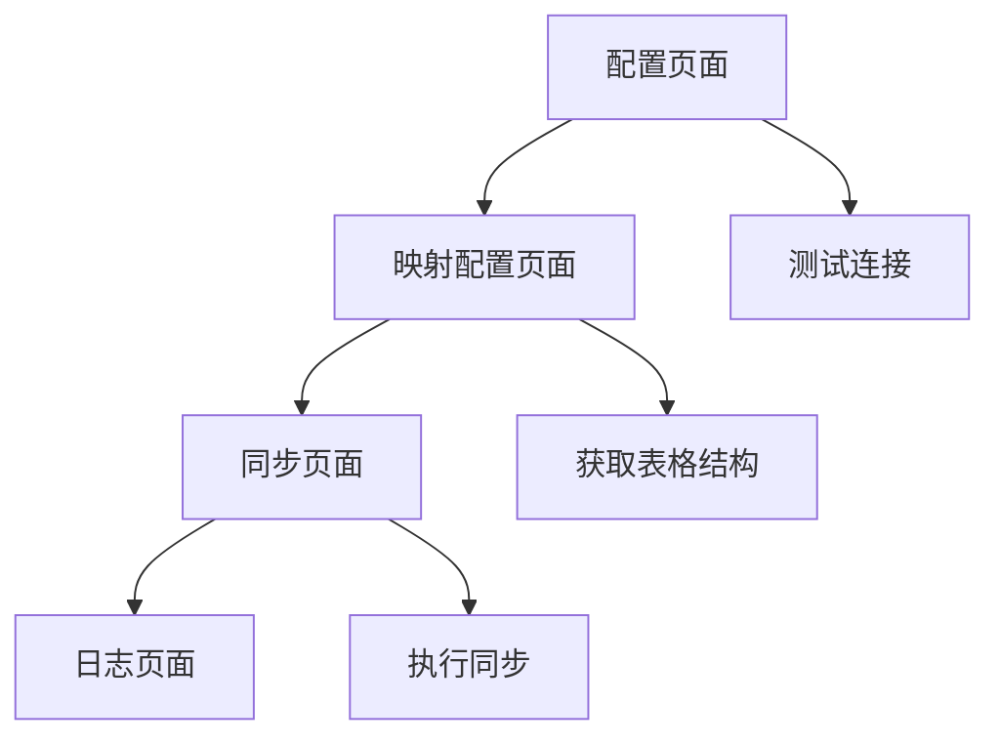

## 1. Product Overview
邮件同步飞书多维表格系统是一个基于IMAP邮箱连接和飞书多维表格Open SDK的数据同步工具。
- 解决邮件数据手动整理和归档的问题，为需要将邮件内容结构化存储到飞书多维表格的用户提供自动化解决方案。
- 目标是提高邮件数据管理效率，实现邮件内容的结构化存储和团队协作。

## 2. Core Features

### 2.1 User Roles
本产品为单用户工具，无需角色区分。

### 2.2 Feature Module
邮件同步飞书多维表格系统包含以下主要页面：
1. **配置页面**：飞书多维表格授权配置，邮箱服务器配置
2. **同步页面**：邮件获取和同步执行，进度显示
3. **映射配置页面**：邮件字段到表格列的映射设置
4. **日志页面**：同步结果和错误日志查看

### 2.3 Page Details

| Page Name | Module Name | Feature description |
|-----------|-------------|---------------------|
| 配置页面 | 飞书配置模块 | 输入多维表格appToken和personalBaseToken，验证授权有效性 |
| 配置页面 | 邮箱配置模块 | 选择邮箱服务商，输入用户名和密码，测试连接 |
| 同步页面 | 邮件获取模块 | 连接邮箱服务器，获取指定数量的邮件，解析邮件内容 |
| 同步页面 | 数据同步模块 | 将邮件数据按映射规则写入飞书多维表格，显示同步进度 |
| 映射配置页面 | 字段映射模块 | 配置邮件字段（主题、发件人、收件人、日期、正文）到表格列的映射关系 |
| 映射配置页面 | 表格结构模块 | 获取目标表格的字段信息，支持字段类型匹配 |
| 日志页面 | 同步日志模块 | 显示同步成功和失败的记录，错误信息详情 |
| 日志页面 | 统计信息模块 | 显示同步总数、成功数、失败数等统计数据 |

## 3. Core Process
用户首先在配置页面输入飞书多维表格的授权信息和邮箱配置，然后在映射配置页面设置邮件字段到表格列的映射关系，最后在同步页面执行邮件获取和数据同步操作，可在日志页面查看同步结果。

## 4. User Interface Design
### 4.1 Design Style
- 主色调：飞书蓝色(#1890FF)，辅助色：浅灰色(#F5F5F5)
- 按钮样式：圆角按钮，主要操作使用蓝色背景
- 字体：系统默认字体，标题16px，正文14px，说明文字12px
- 布局风格：卡片式布局，左侧导航，右侧内容区域
- 图标风格：使用Ant Design图标库，简洁线性风格

### 4.2 Page Design Overview

| Page Name | Module Name | UI Elements |
|-----------|-------------|-------------|
| 配置页面 | 飞书配置模块 | 输入框(appToken, personalBaseToken)，测试连接按钮，状态指示器 |
| 配置页面 | 邮箱配置模块 | 下拉选择框(邮箱服务商)，输入框(用户名，密码)，测试按钮 |
| 同步页面 | 邮件获取模块 | 数量输入框，文件夹选择，获取按钮，邮件列表展示 |
| 同步页面 | 数据同步模块 | 进度条，同步按钮，状态文本，结果统计卡片 |
| 映射配置页面 | 字段映射模块 | 拖拽映射组件，邮件字段列表，表格字段下拉选择 |
| 日志页面 | 同步日志模块 | 表格组件，时间筛选，状态筛选，详情弹窗 |

### 4.3 Responsiveness
桌面优先设计，支持1200px以上宽屏显示，暂不考虑移动端适配。