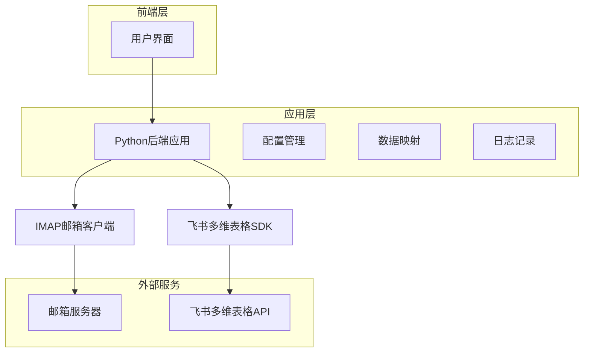
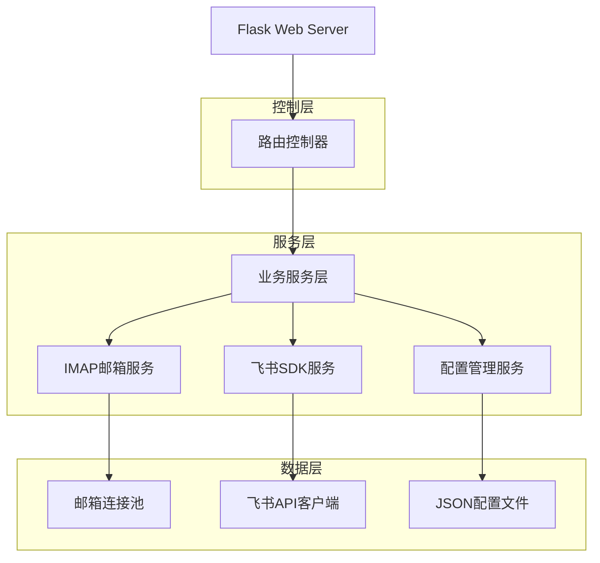
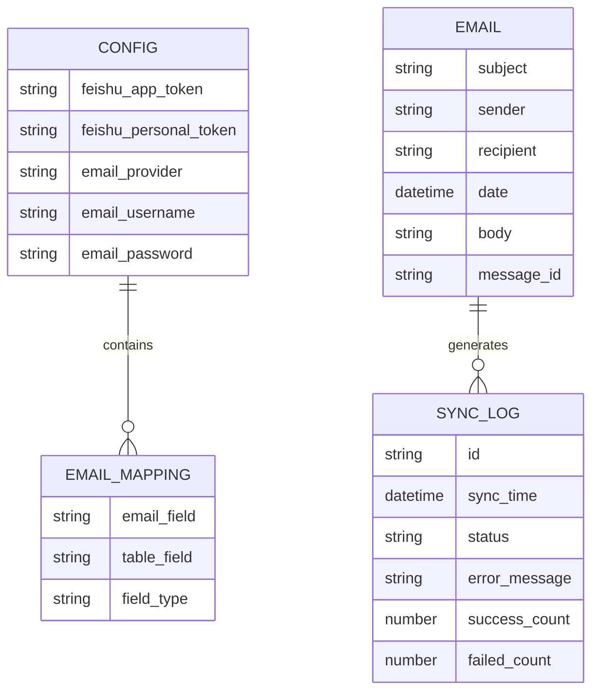

## 1.Architecture design



## 2.Technology Description
- Frontend: React@18 + antd@5 + vite
- Backend: Python@3.8+ + Flask@2.0
- SDK: 飞书多维表格Open SDK (Node.js)
- Database: 本地JSON配置文件

## 3.Route definitions

| Route | Purpose |
|-------|----------|
| /config | 配置页面，设置飞书授权和邮箱配置 |
| /mapping | 映射配置页面，设置字段映射关系 |
| /sync | 同步页面，执行邮件获取和数据同步 |
| /logs | 日志页面，查看同步结果和错误信息 |

## 4.API definitions

### 4.1 Core API

飞书配置相关
```
POST /api/config/feishu
```

Request:
| Param Name | Param Type | isRequired | Description |
|------------|------------|------------|-------------|
| appToken | string | true | 多维表格应用Token |
| personalBaseToken | string | true | 个人基础Token |

Response:
| Param Name | Param Type | Description |
|------------|------------|-------------|
| success | boolean | 配置保存状态 |
| message | string | 结果消息 |

邮件获取相关
```
POST /api/email/fetch
```

Request:
| Param Name | Param Type | isRequired | Description |
|------------|------------|------------|-------------|
| count | number | true | 获取邮件数量 |
| folder | string | false | 邮箱文件夹，默认INBOX |

Response:
| Param Name | Param Type | Description |
|------------|------------|-------------|
| emails | array | 邮件列表 |
| total | number | 获取总数 |

数据同步相关
```
POST /api/sync/execute
```

Request:
| Param Name | Param Type | isRequired | Description |
|------------|------------|------------|-------------|
| emails | array | true | 要同步的邮件数据 |
| mapping | object | true | 字段映射配置 |

Response:
| Param Name | Param Type | Description |
|------------|------------|-------------|
| success | number | 成功同步数量 |
| failed | number | 失败数量 |
| errors | array | 错误详情 |

## 5.Server architecture diagram



## 6.Data model

### 6.1 Data model definition



### 6.2 Data Definition Language

配置文件结构 (config.json)
```json
{
  "feishu": {
    "appToken": "",
    "personalBaseToken": ""
  },
  "email": {
    "provider": "feishu",
    "username": "",
    "password": ""
  },
  "mapping": {
    "subject": "标题",
    "sender": "发件人",
    "recipient": "收件人", 
    "date": "日期",
    "body": "正文内容"
  },
  "sync_settings": {
    "batch_size": 10,
    "retry_count": 3
  }
}
```

同步日志文件结构 (sync_logs.json)
```json
{
  "logs": [
    {
      "id": "uuid",
      "sync_time": "2024-01-01T10:00:00Z",
      "status": "success",
      "success_count": 5,
      "failed_count": 0,
      "errors": []
    }
  ]
}
```