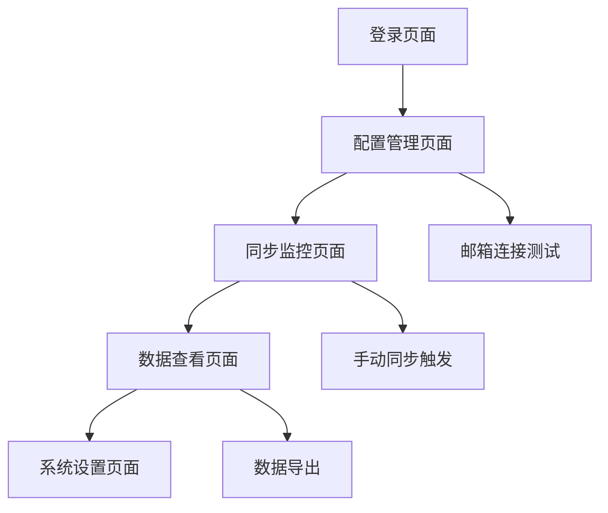

# 飞书邮箱同步系统 - 产品需求文档

## 1. 产品概述

飞书邮箱同步系统是一个自动化工具，通过IMAP协议连接飞书邮箱，定时读取邮件内容并同步到飞书多维表格中，实现邮件数据的结构化管理和团队协作。

该系统解决了邮件信息分散、难以统计分析的问题，为企业提供邮件数据的集中管理和可视化分析能力，提升团队协作效率。

目标市场价值：帮助企业实现邮件数据的自动化管理，减少人工整理成本，提升数据分析效率。

## 2. 核心功能

### 2.1 用户角色

| 角色 | 注册方法 | 核心权限 |
|------|----------|----------|
| 系统管理员 | 飞书企业账号登录 | 配置邮箱连接、管理同步规则、查看系统状态 |
| 普通用户 | 飞书企业账号登录 | 查看同步的邮件数据、设置个人过滤规则 |

### 2.2 功能模块

我们的飞书邮箱同步系统包含以下主要页面：

1. **配置管理页面**：邮箱连接配置、飞书API配置、同步规则设置
2. **同步监控页面**：同步状态监控、日志查看、错误处理
3. **数据查看页面**：邮件数据展示、搜索过滤、统计分析
4. **系统设置页面**：用户权限管理、系统参数配置

### 2.3 页面详情

| 页面名称 | 模块名称 | 功能描述 |
|----------|----------|----------|
| 配置管理页面 | 邮箱连接配置 | 设置IMAP服务器地址、用户名、应用专用密码，测试连接状态 |
| 配置管理页面 | 飞书API配置 | 配置App ID、App Secret、多维表格Token，验证API权限 |
| 配置管理页面 | 同步规则设置 | 设置同步频率、邮件过滤条件、字段映射规则 |
| 同步监控页面 | 同步状态监控 | 显示当前同步状态、最后同步时间、成功/失败统计 |
| 同步监控页面 | 日志查看 | 查看详细的同步日志、错误信息、操作记录 |
| 同步监控页面 | 错误处理 | 重试失败的同步任务、手动触发同步、异常告警 |
| 数据查看页面 | 邮件数据展示 | 以表格形式展示同步的邮件数据，支持分页浏览 |
| 数据查看页面 | 搜索过滤 | 按发件人、主题、时间范围等条件搜索邮件 |
| 数据查看页面 | 统计分析 | 邮件数量统计、发件人分析、时间趋势图表 |
| 系统设置页面 | 用户权限管理 | 管理用户角色、分配访问权限、审计日志 |
| 系统设置页面 | 系统参数配置 | 设置系统运行参数、备份策略、安全配置 |

## 3. 核心流程

### 管理员流程
1. 登录系统 → 配置邮箱连接信息 → 设置飞书API权限 → 配置同步规则 → 启动自动同步
2. 监控同步状态 → 查看日志信息 → 处理异常情况 → 优化同步规则

### 普通用户流程
1. 登录系统 → 查看邮件数据 → 使用搜索过滤功能 → 查看统计分析报告

## 4. 用户界面设计

### 4.1 设计风格

- **主色调**：飞书蓝 (#1890FF)，辅助色为浅灰 (#F5F5F5)
- **按钮样式**：圆角矩形按钮，主要按钮使用蓝色背景
- **字体**：系统默认字体，标题16px，正文14px，说明文字12px
- **布局风格**：卡片式布局，左侧导航栏，顶部面包屑导航
- **图标风格**：使用飞书设计语言的线性图标

### 4.2 页面设计概览

| 页面名称 | 模块名称 | UI元素 |
|----------|----------|--------|
| 配置管理页面 | 邮箱连接配置 | 表单输入框、测试连接按钮、状态指示灯，采用卡片布局，蓝色主题色 |
| 同步监控页面 | 状态监控 | 实时状态卡片、进度条、统计数字，使用绿色表示正常，红色表示异常 |
| 数据查看页面 | 邮件列表 | 数据表格、分页组件、搜索框，支持排序和筛选，行高适中便于阅读 |
| 系统设置页面 | 参数配置 | 配置表单、开关组件、确认对话框，使用警告色提示重要操作 |

### 4.3 响应式设计

系统采用桌面优先设计，支持平板和移动端自适应，在小屏幕设备上导航栏自动折叠，表格支持横向滚动。