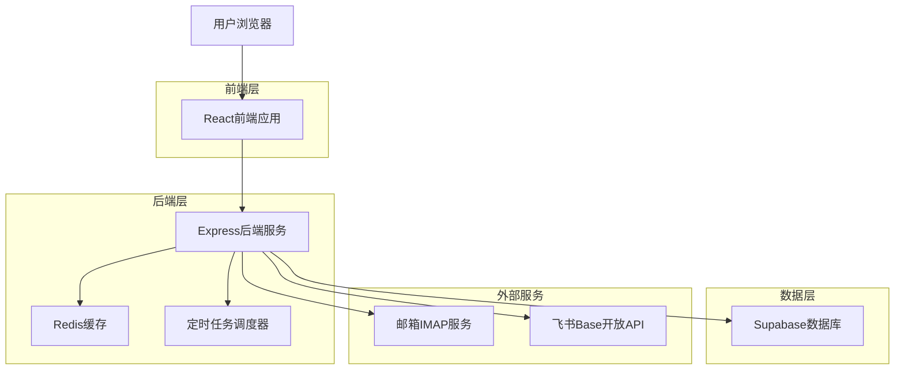
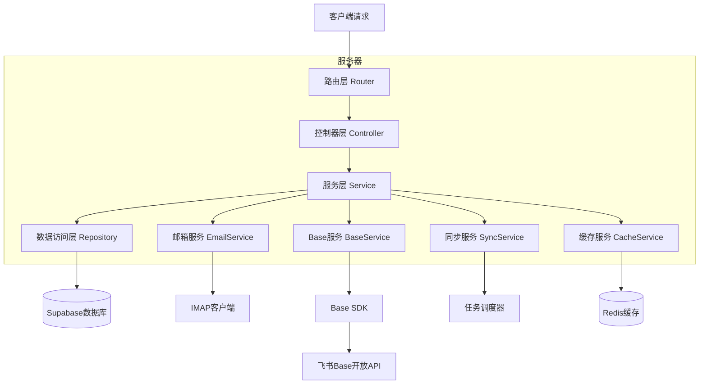
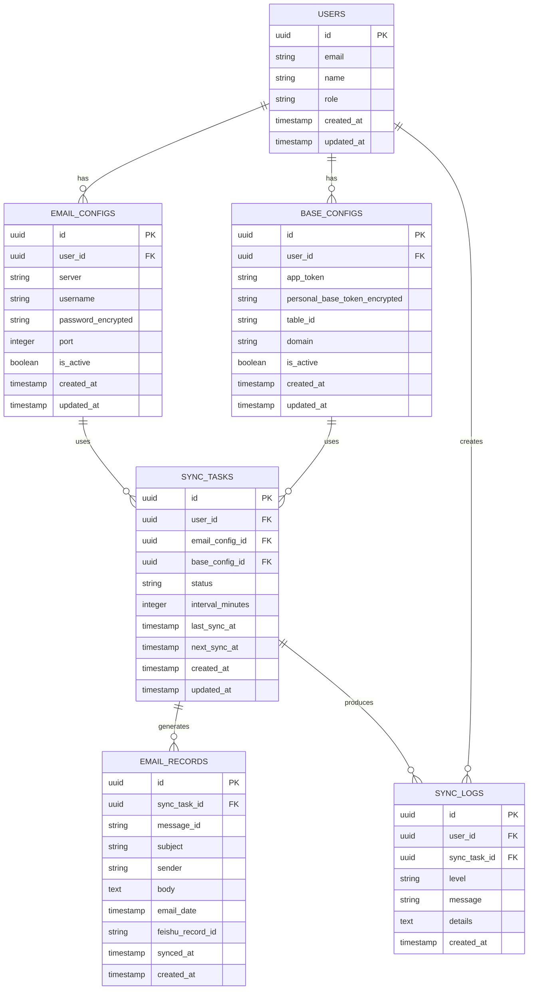

# 飞书邮箱同步系统 - 技术架构文档

## 1. 架构设计



## 2. 技术描述

* 前端：React\@18 + TypeScript + Ant Design + Vite

* 后端：Node.js + Express\@4 + TypeScript

* 数据库：Supabase (PostgreSQL)

* 缓存：Redis\@7

* 邮箱协议：IMAP (node-imap)

* 任务调度：node-cron

* API集成：Base SDK (@lark-base-open/node-sdk)

### 2.1 Base SDK安装与配置

**安装SDK**
```bash
npm install @lark-base-open/node-sdk
```

**SDK初始化**
```typescript
import { BaseClient } from '@lark-base-open/node-sdk';

const client = new BaseClient({
    appToken: process.env.BASE_APP_TOKEN,
    personalBaseToken: process.env.PERSONAL_BASE_TOKEN,
    domain: process.env.FEISHU_DOMAIN || 'feishu' // 可选：feishu 或 lark
});
```

**多维表格操作示例**
```typescript
// 向多维表格添加记录
const addRecord = async (tableId: string, data: any) => {
    const res = await client.base.appTableRecord.create({
        path: {
            table_id: tableId,
        },
        data: {
            fields: data,
        },
    });
    return res;
};

// 查询多维表格记录
const getRecords = async (tableId: string, pageSize: number = 100) => {
    const res = await client.base.appTableRecord.list({
        path: {
            table_id: tableId,
        },
        params: {
            page_size: pageSize,
        },
    });
    return res;
};

// 批量更新记录
const batchUpdateRecords = async (tableId: string, records: any[]) => {
    const res = await client.base.appTableRecord.batchUpdate({
        path: {
            table_id: tableId,
        },
        data: {
            records: records,
        },
    });
    return res;
};

// 使用迭代器分页获取所有记录
const getAllRecords = async (tableId: string) => {
    const allRecords = [];
    for await (const data of await client.base.appTableRecord.listWithIterator({
        path: { table_id: tableId },
        params: { page_size: 50 }
    })) {
        allRecords.push(...data.items);
    }
    return allRecords;
};
```

## 3. 路由定义

| 路由        | 用途                  |
| --------- | ------------------- |
| /         | 首页，显示系统概览和快速操作入口    |
| /login    | 登录页面，支持飞书OAuth认证    |
| /config   | 配置管理页面，设置邮箱和飞书API连接 |
| /monitor  | 同步监控页面，查看同步状态和日志    |
| /data     | 数据查看页面，浏览和搜索邮件数据    |
| /settings | 系统设置页面，用户权限和系统参数管理  |

## 4. API定义

### 4.1 核心API

**用户认证相关**

```
POST /api/auth/login
```

请求参数：

| 参数名  | 参数类型   | 是否必需 | 描述         |
| ---- | ------ | ---- | ---------- |
| code | string | true | 飞书OAuth授权码 |

响应参数：

| 参数名     | 参数类型    | 描述      |
| ------- | ------- | ------- |
| success | boolean | 登录是否成功  |
| token   | string  | JWT访问令牌 |
| user    | object  | 用户信息    |

示例：

```json
{
  "code": "auth_code_from_feishu"
}
```

**邮箱配置相关**

```
POST /api/config/email
```

请求参数：

| 参数名      | 参数类型   | 是否必需  | 描述        |
| -------- | ------ | ----- | --------- |
| server   | string | true  | IMAP服务器地址 |
| username | string | true  | 邮箱用户名     |
| password | string | true  | 应用专用密码    |
| port     | number | false | 端口号，默认993 |

响应参数：

| 参数名     | 参数类型    | 描述     |
| ------- | ------- | ------ |
| success | boolean | 配置是否成功 |
| message | string  | 结果消息   |

**Base SDK配置**

```
POST /api/config/base
```

请求参数：

| 参数名               | 参数类型   | 是否必需 | 描述                    |
| ----------------- | ------ | ---- | --------------------- |
| appToken          | string | true | Base文档的唯一标识          |
| personalBaseToken | string | true | Base文档授权码            |
| tableId           | string | true | 数据表ID                |
| domain            | string | false | 应用域名，默认为feishu（可选lark） |

**同步控制**

```
POST /api/sync/start
POST /api/sync/stop
GET /api/sync/status
```

**邮件数据查询**

```
GET /api/emails
```

请求参数：

| 参数名       | 参数类型   | 是否必需  | 描述        |
| --------- | ------ | ----- | --------- |
| page      | number | false | 页码，默认1    |
| limit     | number | false | 每页数量，默认20 |
| search    | string | false | 搜索关键词     |
| sender    | string | false | 发件人过滤     |
| startDate | string | false | 开始日期      |
| endDate   | string | false | 结束日期      |

## 5. 服务器架构图



## 6. 数据模型

### 6.1 数据模型定义



### 6.2 数据定义语言

**用户表 (users)**

```sql
-- 创建用户表
CREATE TABLE users (
    id UUID PRIMARY KEY DEFAULT gen_random_uuid(),
    email VARCHAR(255) UNIQUE NOT NULL,
    name VARCHAR(100) NOT NULL,
    role VARCHAR(20) DEFAULT 'user' CHECK (role IN ('admin', 'user')),
    created_at TIMESTAMP WITH TIME ZONE DEFAULT NOW(),
    updated_at TIMESTAMP WITH TIME ZONE DEFAULT NOW()
);

-- 创建索引
CREATE INDEX idx_users_email ON users(email);
CREATE INDEX idx_users_role ON users(role);

-- 权限设置
GRANT SELECT ON users TO anon;
GRANT ALL PRIVILEGES ON users TO authenticated;
```

**邮箱配置表 (email\_configs)**

```sql
-- 创建邮箱配置表
CREATE TABLE email_configs (
    id UUID PRIMARY KEY DEFAULT gen_random_uuid(),
    user_id UUID NOT NULL REFERENCES users(id) ON DELETE CASCADE,
    server VARCHAR(255) NOT NULL,
    username VARCHAR(255) NOT NULL,
    password_encrypted TEXT NOT NULL,
    port INTEGER DEFAULT 993,
    is_active BOOLEAN DEFAULT true,
    created_at TIMESTAMP WITH TIME ZONE DEFAULT NOW(),
    updated_at TIMESTAMP WITH TIME ZONE DEFAULT NOW()
);

-- 创建索引
CREATE INDEX idx_email_configs_user_id ON email_configs(user_id);
CREATE INDEX idx_email_configs_is_active ON email_configs(is_active);

-- 权限设置
GRANT SELECT ON email_configs TO anon;
GRANT ALL PRIVILEGES ON email_configs TO authenticated;
```

**Base配置表 (base\_configs)**

```sql
-- 创建Base配置表
CREATE TABLE base_configs (
    id UUID PRIMARY KEY DEFAULT gen_random_uuid(),
    user_id UUID NOT NULL REFERENCES users(id) ON DELETE CASCADE,
    app_token VARCHAR(255) NOT NULL,
    personal_base_token_encrypted TEXT NOT NULL,
    table_id VARCHAR(255) NOT NULL,
    domain VARCHAR(20) DEFAULT 'feishu' CHECK (domain IN ('feishu', 'lark')),
    is_active BOOLEAN DEFAULT true,
    created_at TIMESTAMP WITH TIME ZONE DEFAULT NOW(),
    updated_at TIMESTAMP WITH TIME ZONE DEFAULT NOW()
);

-- 创建索引
CREATE INDEX idx_base_configs_user_id ON base_configs(user_id);
CREATE INDEX idx_base_configs_is_active ON base_configs(is_active);
CREATE INDEX idx_base_configs_app_token ON base_configs(app_token);

-- 权限设置
GRANT SELECT ON base_configs TO anon;
GRANT ALL PRIVILEGES ON base_configs TO authenticated;
```

**同步任务表 (sync\_tasks)**

```sql
-- 创建同步任务表
CREATE TABLE sync_tasks (
    id UUID PRIMARY KEY DEFAULT gen_random_uuid(),
    user_id UUID NOT NULL REFERENCES users(id) ON DELETE CASCADE,
    email_config_id UUID NOT NULL REFERENCES email_configs(id) ON DELETE CASCADE,
    base_config_id UUID NOT NULL REFERENCES base_configs(id) ON DELETE CASCADE,
    status VARCHAR(20) DEFAULT 'pending' CHECK (status IN ('pending', 'running', 'completed', 'failed', 'paused')),
    interval_minutes INTEGER DEFAULT 30,
    last_sync_at TIMESTAMP WITH TIME ZONE,
    next_sync_at TIMESTAMP WITH TIME ZONE,
    created_at TIMESTAMP WITH TIME ZONE DEFAULT NOW(),
    updated_at TIMESTAMP WITH TIME ZONE DEFAULT NOW()
);

-- 创建索引
CREATE INDEX idx_sync_tasks_user_id ON sync_tasks(user_id);
CREATE INDEX idx_sync_tasks_status ON sync_tasks(status);
CREATE INDEX idx_sync_tasks_next_sync_at ON sync_tasks(next_sync_at);

-- 权限设置
GRANT SELECT ON sync_tasks TO anon;
GRANT ALL PRIVILEGES ON sync_tasks TO authenticated;
```

**邮件记录表 (email\_records)**

```sql
-- 创建邮件记录表
CREATE TABLE email_records (
    id UUID PRIMARY KEY DEFAULT gen_random_uuid(),
    sync_task_id UUID NOT NULL REFERENCES sync_tasks(id) ON DELETE CASCADE,
    message_id VARCHAR(255) NOT NULL,
    subject TEXT,
    sender VARCHAR(255),
    body TEXT,
    email_date TIMESTAMP WITH TIME ZONE,
    feishu_record_id VARCHAR(255),
    synced_at TIMESTAMP WITH TIME ZONE DEFAULT NOW(),
    created_at TIMESTAMP WITH TIME ZONE DEFAULT NOW()
);

-- 创建索引
CREATE INDEX idx_email_records_sync_task_id ON email_records(sync_task_id);
CREATE INDEX idx_email_records_message_id ON email_records(message_id);
CREATE INDEX idx_email_records_sender ON email_records(sender);
CREATE INDEX idx_email_records_email_date ON email_records(email_date DESC);

-- 权限设置
GRANT SELECT ON email_records TO anon;
GRANT ALL PRIVILEGES ON email_records TO authenticated;
```

**同步日志表 (sync\_logs)**

```sql
-- 创建同步日志表
CREATE TABLE sync_logs (
    id UUID PRIMARY KEY DEFAULT gen_random_uuid(),
    user_id UUID NOT NULL REFERENCES users(id) ON DELETE CASCADE,
    sync_task_id UUID REFERENCES sync_tasks(id) ON DELETE CASCADE,
    level VARCHAR(10) DEFAULT 'info' CHECK (level IN ('debug', 'info', 'warn', 'error')),
    message TEXT NOT NULL,
    details JSONB,
    created_at TIMESTAMP WITH TIME ZONE DEFAULT NOW()
);

-- 创建索引
CREATE INDEX idx_sync_logs_user_id ON sync_logs(user_id);
CREATE INDEX idx_sync_logs_sync_task_id ON sync_logs(sync_task_id);
CREATE INDEX idx_sync_logs_level ON sync_logs(level);
CREATE INDEX idx_sync_logs_created_at ON sync_logs(created_at DESC);

-- 权限设置
GRANT SELECT ON sync_logs TO anon;
GRANT ALL PRIVILEGES ON sync_logs TO authenticated;
```

**初始化数据**

```sql
-- 插入管理员用户
INSERT INTO users (email, name, role) VALUES 
('admin@company.com', '系统管理员', 'admin');

-- 插入示例邮箱配置（需要实际配置时替换）
INSERT INTO email_configs (user_id, server, username, password_encrypted, port) 
SELECT id, 'imap.feishu.cn', 'example@company.feishu.cn', 'encrypted_password', 993 
FROM users WHERE email = 'admin@company.com';

-- 插入示例Base配置（需要实际配置时替换）
INSERT INTO base_configs (user_id, app_token, personal_base_token_encrypted, table_id, domain) 
SELECT id, 'bascnxxxxxxxxxxxxxx', 'encrypted_personal_base_token', 'tblxxxxxxxxxxxxxx', 'feishu' 
FROM users WHERE email = 'admin@company.com';
```

